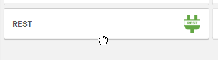
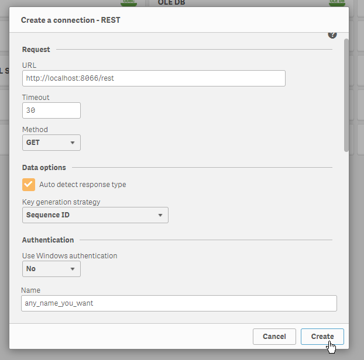
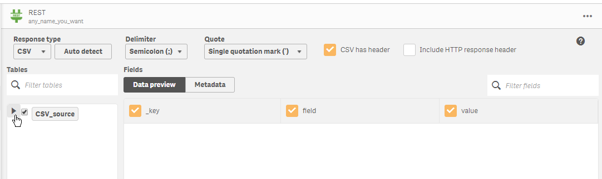

# InputTable

## Backend

Query to create table
You can change `database_name` to any database name you want
```sql
CREATE TABLE [dbo].[database_name](
	[_key] [nvarchar](32) NULL,
	[field] [nvarchar](32) NULL,
	[value] [int] NULL,
	[editable] [tinyint] NULL,
	[created] [datetime] NULL
) ON [PRIMARY];
```


Install and run server
```bash
npm install
node server.js
```

Add/edit a `config.json` file in `config/` folder like this
```js
{
    "user": "example_user",
    "password": "example_password",
    "server": "EXAMPLE_SERVER",
    "database": "example_db",
    "port": 1433,
    "options":
    {
        "instanceName": "EXAMPLE_INSTANCENAME"
    }
}
```

Add a key
```bash
node add_key_on_field.js apple 2017-06
```

Lock field
```bash
node lock_field.js 2017-06
```

Open (create new) field
```bash
node open_field.js 2017-06
```

You can test form using a webclient. Goto `http://localhost:8066`


## Qlik (Desktop)

### Setup extension
Copy `extension/it` to Qlik Desktop extension folder.

Edit `config.json` found in root folder of the extension if your backend is not found on `localhost`
```js
{
    "url": "http://<SOME HOST HERE>:8066",
}
```

### Setup data connection

Change `localhost` to your host if you do not use localhost


